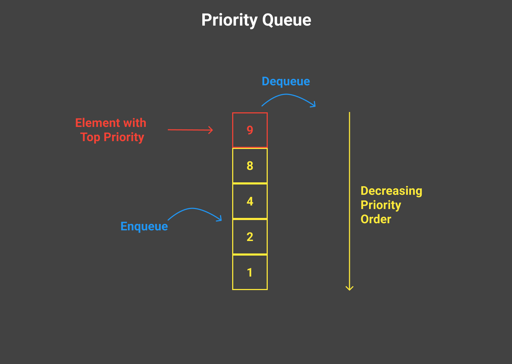

# Priority Queue

<a href="https://github.com/rain1024/datastructures-algorithms-competitive-programming/blob/main/concepts/cpp/labs/priority_queue.ipynb">

</a>

A priority queue is an abstract data type that allows the storage of elements with priority. The elements are stored in such a way that the element with the highest priority is always at the front of the queue, and the element with the lowest priority is at the back of the queue.




## 🎨 Priority Queue Design

**Methods**

|                | Definition                                                  |
|----------------|-------------------------------------------------------------|
| enqueue        | Add element to the queue                                    |
| dequeue        | remove the element with the highest priority from the queue |


## 💻 Priority Queue Implementation in C++

C++ has built-in object [`priority_queue`](https://cplusplus.com/reference/queue/priority_queue/) in `queue` library.

```cpp
#include <iostream>
#include <queue>

int main(){
  priority_queue<int> pq;

  pq.push(1);
  pq.push(5);
  pq.push(3);

  while (!pq.empty()) {
      cout << pq.top() << endl;
      pq.pop();
}

  return 0;
}

```

## 📈 Complexity Analysis of Priority Queue


| Operation       | Complexity          |
|-----------------|---------------------|
| push            | $O(log N)$          |
| pop             | $O(log N)$          |
| top             | $O(1)$              |

## 🔗 Further Reading

* [Priority Queue (data structures)](https://en.wikipedia.org/wiki/Priority_queue), wikipedia
* ▶️ [Priority Queue (1/5) Introduction](https://www.youtube.com/watch?v=wptevk0bshY&ab_channel=WilliamFiset), WilliamFiset, 2017
* ▶️ [Priority Queue (2/5) Min Heaps and Max Heaps](https://www.youtube.com/watch?v=HCEr35qpawQ&ab_channel=WilliamFiset), WilliamFiset, 2017
* ▶️ [Priority Queue (3/5) Inserting Elements](https://www.youtube.com/watch?v=QOJ-CmQiXko&list=PLDV1Zeh2NRsB6SWUrDFW2RmDotAfPbeHu&index=16&ab_channel=WilliamFiset), WilliamFiset, 2017
* ▶️ [Priority Queue (4/5) Removing Elements](https://www.youtube.com/watch?v=eVq8CmoC1x8&list=PLDV1Zeh2NRsB6SWUrDFW2RmDotAfPbeHu&index=17&ab_channel=WilliamFiset), WilliamFiset, 2017
* ▶️ [Priority Queue (5/5) Code](https://www.youtube.com/watch?v=GLIRnUhknP0&list=PLDV1Zeh2NRsB6SWUrDFW2RmDotAfPbeHu&index=18&ab_channel=WilliamFiset), WilliamFiset, 2017
