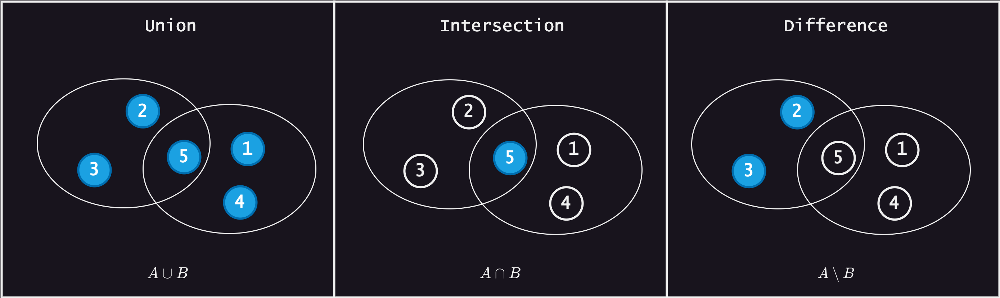

# Set

> A set is an abstract data type that is used to store a collection of elements. It is a container that stores a collection of unique elements in a specific order. The elements in a set are usually sorted according to their keys, which are used to identify the elements in the set.


Sets are typically implemented using balanced binary search trees, such as red-black trees or AVL trees. These data structures allow for fast insertions, deletions, and searches in the set.

In addition to the basic operations of inserting, deleting, and searching for elements, sets also support a number of other operations, such as union, intersection, and difference.



Sets are often used to implement logic operations in computer science, such as union-find algorithms, and are also useful for efficiently storing and manipulating large collections of data.

## 💻 Set Implementation in C++

In C++, the `std::set` is a container that stores a collection of unique elements in a specific order. The elements in a set are sorted according to their keys, which are stored in the set.

Here is an example of how to use `std::set` in C++:

```cpp
#include <iostream>
#include <set>

using namespace std;

int main() {
  set<int> s;

  // Insert elements into the set
  s.insert(2);
  s.insert(3);
  s.insert(5);
  s.insert(2); // This element is not inserted, since 2 is already in the set

  cout << "Print the elements of the set" << endl;
  for (int x : s) {
    cout << x << endl;
  }

  // Remove the element with value 3 from the set
  s.erase(3);

  cout << "Set after remove value 3" << endl;
  for (int x : s) {
    cout << x << endl;
  }

  return 0;
}
```

Output:

```
Print the elements of the set
2
3
5
```

Here's an example of how you can use `set_union`, `set_intersection` and `set_difference` to perform basic set operations on C++

```cpp
#include <iostream>
#include <set>

using namespace std;

int main() {
  set<int> A = {2, 3, 5};
  set<int> B = {1, 4, 5};
  
  cout << "Set Union" << endl;
  set<int> C;
  set_union(A.begin(), A.end(), B.begin(), B.end(), inserter(C, C.begin()));
  for(int x : C){
      cout << x << " ";
  }
  cout << endl;
  
  cout << "Set Intersection" << endl;
  set<int> D;
  set_intersection(A.begin(), A.end(), B.begin(), B.end(), inserter(D, D.begin()));
  for(int x : D){
      cout << x << " ";
  }
  cout << endl;
  
  cout << "Set Difference: A - B" << endl;
  set<int> E1;
  set_difference(A.begin(), A.end(), B.begin(), B.end(), inserter(E1, E1.begin()));
  for(int x : E1){
      cout << x << " ";
  }
  cout << endl;
  
  cout << "Set Difference: B - A" << endl;
  set<int> E2;
  set_difference(B.begin(), B.end(), A.begin(), A.end(), inserter(E2, E2.begin()));
  for(int x : E2){
      cout << x << " ";
  }
  cout << endl;
  
  return 0;
}
```

Output:

```
Set Union
1 2 3 4 5 
Set Intersection
5 
Set Difference: A - B
2 3 
Set Difference: B - A
1 4 
```

## 📈 Complexity Analysis of Set

| Operation      | Method          | Time complexity |
|----------------|-----------------|-----------------|
| Insert         | insert          | $$O(log n)$$    |
| Delete         | erase           | $$O(log n)$$    |
| Union          | set_union       | $$O(m log n)$$  |
| Intersection   | set_intersection| $$O(m log n)$$  |
| Difference     | set_difference  | $$O(m log n)$$  |

## 🔗 Further Reading

* [Set (abstract data type)](https://en.wikipedia.org/wiki/Set_(abstract_data_type)), wikipedia
* ▶️ [Set in C++ STL](https://www.youtube.com/watch?v=4FJrP6aAwSs&ab_channel=Codevolution), GeeksforGeeks
* [set_union](https://cplusplus.com/reference/algorithm/set_union/), cplusplus.com/reference
* [set_union](https://cplusplus.com/reference/algorithm/set_union/), cplusplus.com/reference
* [set_intersection](https://cplusplus.com/reference/algorithm/set_intersection/), cplusplus.com/reference
* [set_intersection](https://cplusplus.com/reference/algorithm/set_intersection/), cplusplus.com/reference
* [set_difference](https://cplusplus.com/reference/algorithm/set_difference/), cplusplus.com/reference