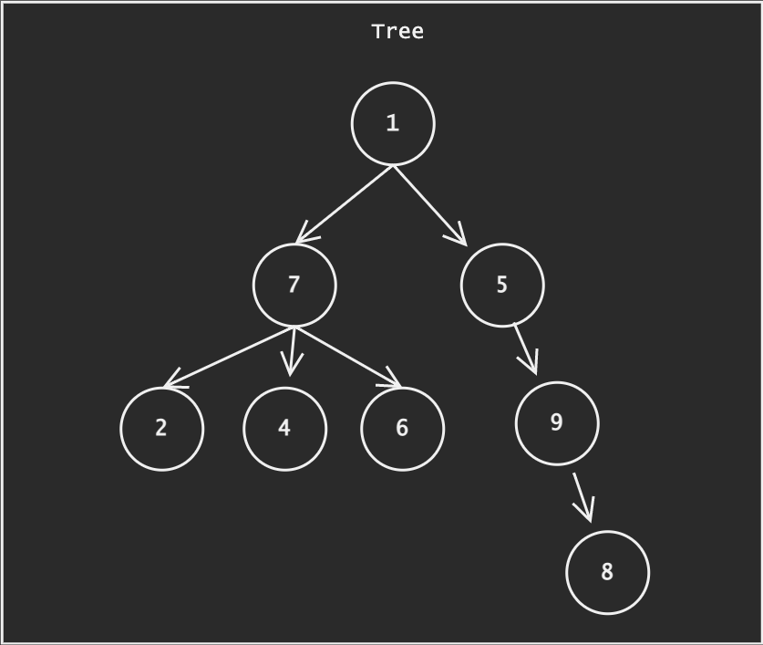
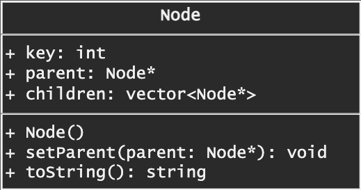

# Tree

From wikipedia

> In computer science, a tree is a widely used abstract data type that represents a hierarchical tree structure with a set of connected nodes. Each node in the tree can be connected to many children (depending on the type of tree), but must be connected to exactly one parent, except for the root node, which has no parent.




## 🎨 Tree Design



**Properties**

|                | Definition                              |
|----------------|-----------------------------------------|
| key            | value of node                           |
| parent         | parent of node                          |
| children       | children of node                        |

**Methods**

|                 | Definition      |
|-----------------|--------------------------------|
| Node()          | Construct node from a value     |
| setParent       | set parent to the node    |
| toString        | convert node to string     |


## 💻 Tree Implementation in C++

⚠️ C++ hasn't has built-in object `Tree`.

Here are the implementation of Tree in C++ from scratch.

File [**`tree.cpp`**](code/tree.cpp)

```cpp
#include <iostream>
#include <vector>

using namespace std;

class Node {
public:
    int key;
    Node* parent;
    vector<Node*> children;
    
    Node(int key){
        this->parent = NULL;
        this->key = key;
    }
    
    void setParent(Node* parent){
        this->parent = parent;
        parent->children.push_back(this);
    }
    
    string toString(){
        return to_string(this->key);
    }
};

int main()
{
    Node* n1 = new Node(1);
    Node* n2 = new Node(2);
    n2->setParent(n1);
    cout << n1->toString() << endl;
}
```

## 📈 Complexity Analysis of [Awesome Type]


| Operation       | Complexity          |
|-----------------|---------------------|
| Operation       | $O(log(n))$         |

## 🔗 Further Reading

* [Tree (data structures)](https://en.wikipedia.org/wiki/Tree_(data_structure)), wikipedia
* ▶️ [Data Structures (Full Course Using C and C++) - Introduction to Trees](https://youtu.be/B31LgI4Y4DQ?t=18855)
* ▶️ [Data Structures Course - Trees](https://www.coursera.org/lecture/data-structures/trees-95qda)
