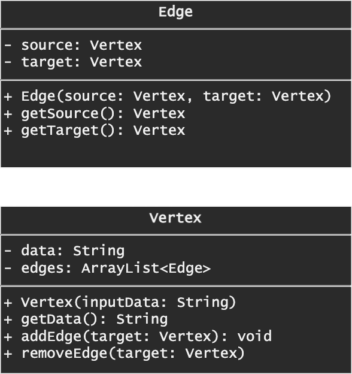

# Graph

From wikipedia

> In graph theory, a graph is a structure amounting to a set of objects in which some pairs of the objects are in some sense "related". The objects correspond to mathematical abstractions called vertices (also called nodes or points) and each of the related pairs of vertices is called an edge (also called link or line).


## Graph Representation

Graph Representation Implemetation in Java

```java
import java.util.ArrayList; 

class Edge {
    private Vertex source;
    private Vertex target;
    
    public Edge(Vertex source, Vertex target){
        this.source = source;
        this.target = target;
    }
    
    public Vertex getSource(){
        return this.source;
    }
    
    public Vertex getTarget(){
        return this.target;
    }
}

class Vertex {
    private String data;
    private ArrayList<Edge> edges;
    
    public Vertex(String inputData){
        this.data = inputData;
        this.edges = new ArrayList<Edge>();
    }
    
    public String getData(){
        return this.data;
    }
    
    public ArrayList<Edge> getEdges(){
        return this.edges;
    }
    
    public void addEdge(Vertex target){
        this.edges.add(new Edge(this, target));
    }
    
    public void removeEdge(Vertex target){
        this.edges.removeIf(edge -> edge.getTarget().equals(target));
    }
    
    public String toString(){
        String s = "";
        s += this.getData();
        if (this.edges.size() == 0){
            s += " -> null";
        } else {
            s += " -> ";
            for(Edge e: this.edges){
                s += e.getTarget().getData() + " ";
            }
        }
        return s;
    }
}

class Graph {
    private ArrayList<Vertex> vertices;
    private boolean isWeighted;
    private boolean isDirected;
    
    public Graph(boolean isWeighted, boolean isDirected){
        this.vertices = new ArrayList<Vertex>();
        this.isWeighted = isWeighted;
        this.isDirected = isDirected;
    }
    
    public Vertex addVertex(String data){
        Vertex v = new Vertex(data);
        this.vertices.add(v);
        return v;
    }
    
    public void addEdge(Vertex v1, Vertex v2){
        v1.addEdge(v2);
        if (!this.isDirected){
            v2.addEdge(v1);
        }
    }
    
    public void removeEdge(Vertex v1, Vertex v2){
        v1.removeEdge(v2);
        if (!this.isDirected){
            v2.removeEdge(v1);
        }
    }
    
    public void removeVertex(Vertex v){
        this.vertices.remove(v);
        for(Vertex v0: this.vertices){
            v0.removeEdge(v);
        }
    }
    
    public String toString(){
        String s = "";
        for(Vertex v: this.vertices){
            s +=  v.toString() + "\n";
        }
        return s;
    }

}

class Main {
    public static void main(String[] args) {
        System.out.println("Graph Representation");
        
        Graph g = new Graph(false, true);
        Vertex v1 = g.addVertex("1");
        Vertex v2 = g.addVertex("2");
        Vertex v3 = g.addVertex("3");
        g.addEdge(v1, v2);
        g.addEdge(v1, v3);
        g.addEdge(v2, v3);
        System.out.println(g);
        
        // Remove Edge
        g.removeEdge(v2, v3);
        System.out.println("Remove edge");
        System.out.println(g);
        
        // Remove Vertex
        g.removeVertex(v3);
        System.out.println("Remove vertex");
        System.out.println(g);
    }
}
```

Output

```
Graph Representation
1 -> 2 3 
2 -> 3 
3 -> null

Remove edge
1 -> 2 3 
2 -> null
3 -> null

Remove vertex
1 -> 2 
2 -> null
```

## Graph Traversal

Graph Traversal Implemetation in Java

DFS

```java
public void dfs(Vertex v) {
    HashSet<Vertex> visited = new HashSet<Vertex>();
    Stack<Vertex> s = new Stack();
    s.push(v);

    while (!s.isEmpty()) {
        Vertex vertex = s.pop();
        System.out.println(vertex.getData());
        if (!visited.contains(vertex)){
            for(Edge e: vertex.getEdges()){
                Vertex target = e.getTarget();
                if(!visited.contains(target)){
                    s.push(target);
                }
            }
        }
    }
}
```

BFS

```java
public void bfs(Vertex v){
    HashSet<Vertex> visited = new HashSet<Vertex>();
    Queue<Vertex> q = new LinkedList();
    q.add(v);

    while (!q.isEmpty()) {
        Vertex vertex = q.remove();
        System.out.println(vertex.getData());
        if (!visited.contains(vertex)){
            for(Edge e: vertex.getEdges()){
                Vertex target = e.getTarget();
                if(!visited.contains(target)){
                    q.add(target);
                }
            }
        }
    }
  }
```

### UML



## 🔗 Further Reading

* [Graph (discrete_mathematics)](https://en.wikipedia.org/wiki/Graph_(discrete_mathematics)), wikipedia
* [Graph and its representations | GeeksforGeeks), GeeksforGeeks
* [Graph Algorithms for Technical Interviews - Full Course](https://en.wikipedia.org/wiki/Graph_(discrete_mathematics)), freeCodeCamp.org
