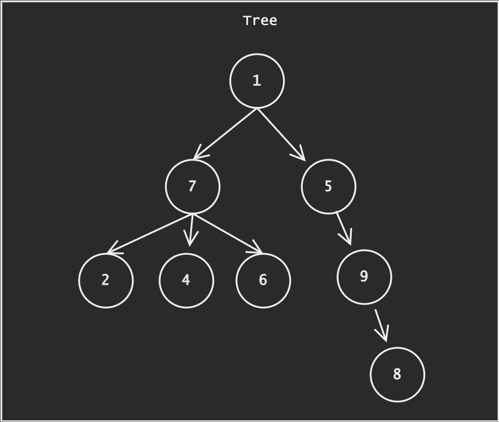

# Tree

From wikipedia

> In computer science, a tree is a widely used abstract data type that represents a hierarchical tree structure with a set of connected nodes. Each node in the tree can be connected to many children (depending on the type of tree), but must be connected to exactly one parent, except for the root node, which has no parent.




## 🎨 Tree Design

**Properties**

|          | Definition       |
| -------- | ---------------- |
| value    | value of node    |
| parent   | parent of node   |
| children | children of node |

**Methods**

|           | Definition                  |
| --------- | --------------------------- |
| Node()    | Construct node from a value |
| set_child | set child to the node       |


## 📈 Complexity Analysis of Tree

| Operation | Complexity |
| --------- | ---------- |
| set_child | $O(1)$     |

## 💻 Tree Implementation in Python

Here are the implementation of Tree in Python from scratch.

```python
import random
import string


class Node(object):
    def __init__(self, value, children=None, parent=None):
        self.value = value
        self.parent = parent
        if parent is not None:
            parent.add_child(self)
        self.children = []
        if children is not None:
            for child in children:
                self.add_child(child)

    def __repr__(self):
        return str(self.value)

    def add_child(self, node):
        node.parent = self
        assert isinstance(node, Node)
        self.children.append(node)

if __name__ == '__main__':
    root_node = Node(value=1)
    child_node_1 = Node(value=2, parent=root_node)
    child_node_2 = Node(value=3, parent=root_node)
    print(root_node)               # 1
    print(root_node.children)      # [2, 3]
    print(child_node_1.parent)     # 1
```


## 🔗 Further Reading

* [Tree (data structures)](https://en.wikipedia.org/wiki/Tree_(data_structure)), wikipedia
* ▶️ [Python Tree Implementation with BigTree](https://towardsdatascience.com/python-tree-implementation-with-bigtree-13cdabd77adc), towardsdatascience 2022
* ▶️ [Data Structures: Trees](https://www.youtube.com/watch?v=oSWTXtMglKE), HackerRank
