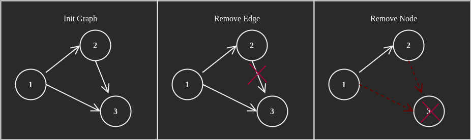
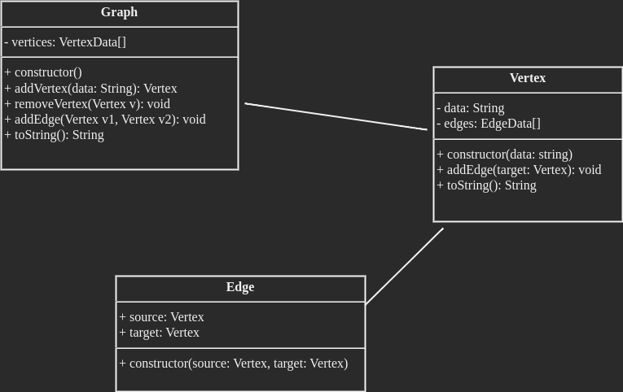

# Graph

From wikipedia

> In graph theory, a graph is a structure amounting to a set of objects in which some pairs of the objects are in some sense "related". The objects correspond to mathematical abstractions called vertices (also called nodes or points) and each of the related pairs of vertices is called an edge (also called link or line).




## 🎨 Graph Design



### Class Graph

**Properties**

|             | Definition                             |
|-------------|----------------------------------------|
| vertices    | all the vertices of graph              |

**Methods**

|                 | Definition                                      |
|-----------------|-------------------------------------------------|
| addVertex       | Add the new vertex to the graph                 |
| removeVertex    | Remove vertex from the graph                    |
| addEdge         | Add the new edge to the graph                   |

### Class Vertex

**Properties**

|             | Definition                             |
|-------------|----------------------------------------|
| data        | all the vertices of graph              |

**Methods**

|                 | Definition                                      |
|-----------------|-------------------------------------------------|
| addVertex       | Add the new vertex to the graph                 |
| removeVertex    | Remove vertex from the graph                    |
| addEdge         | Add the new edge to the graph                   |

### Class Vertex


## 💻 Graph Implementation in Typescript

Typescript has standard built-in object [`Set`](https://developer.mozilla.org/en-US/docs/Web/JavaScript/Reference/Global_Objects/Set)

```ts
let s = new Set();  
s.add('2');
s.add('3')
s.add('5')
console.log(s);            // Set (3) {"2", "3", "5"} 
console.log(s.has('1'));   // false
console.log(s.has('2'));   // true
s.delete('5')    
console.log(s);            // Set (2) {"2", "3"} 
s.add('4');
console.log(s)             // Set (3) {"2", "3", "4"} 
```

## 📈 Complexity Analysis of Set


| Operation       | Set                 |
|-----------------|---------------------|
| Insert          | $O(1)$              |
| Delete          | $O(1)$              |
| Check exist     | $O(1)$              |

## 🔗 References

* 2022, [Standard built-in objects > Set](https://developer.mozilla.org/en-US/docs/Web/JavaScript/Reference/Global_Objects/Set), developer.mozilla.org