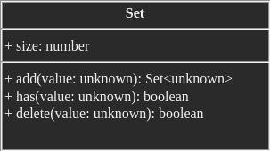

# Set

From wikipedia

> In computer science, a set is an abstract data type that can store unique values, without any particular order. It is a computer implementation of the mathematical concept of a finite set. Unlike most other collection types, rather than retrieving a specific element from a set, one typically tests a value for membership in a set.

From official typescript document 

> The Set object lets you store unique values of any type, whether primitive values or object references.

## Visualization


## Set Design



## Time Complexity Analysis of Array


| Operation       | Singly Linked List  |
|-----------------|---------------------|
| Insert          | $O(1)$              |
| Delete          | $O(1)$              |
| Check exist     | $O(1)$              |

## Set Implementation in Typescript

```ts
let s = new Set();  
s.add("1");
s.add("2")
s.add("3")
console.log(s);
console.log(s.has("1"));
s.delete("2")
console.log(s);
```

## References

* 2022, [Standard built-in objects > Set](https://developer.mozilla.org/en-US/docs/Web/JavaScript/Reference/Global_Objects/Set), developer.mozilla.org