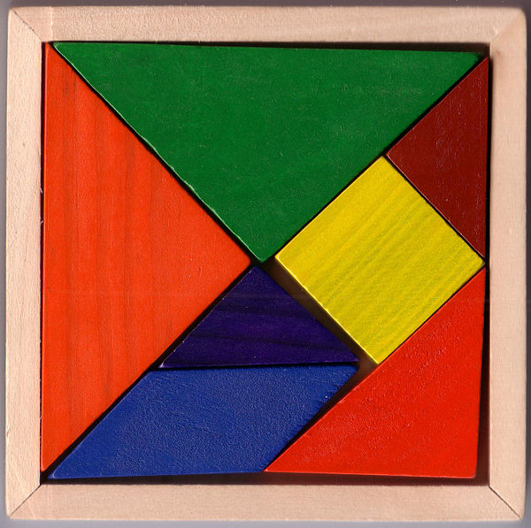

# Tangram

From wikipedia

> The tangram is a dissection puzzle consisting of seven flat polygons, called tans, which are put together to form shapes. The objective is to replicate a pattern (given only an outline) generally found in a puzzle book using all seven pieces without overlap.



**Trí Uẩn**

> Tri Uan game is a jigsaw puzzle with seven pieces belonging to a rectangle with dimensions of 8 cm x 10 cm familiar to many Vietnamese students in the 1960s-1970s.


## Implementation 

We used [OpenGL](https://www.opengl.org/) to draw starting position for Trí Uẩn angram.

## Run 

Run the following command to start program

```
g++ -std=c++17 solution.cpp -o solution -framework GLUT -framework OpenGL -Wno-deprecated-declarations && ./solution
```


## 🔗 Further Reading

* https://en.wikipedia.org/wiki/Tangram
* https://vi.wikipedia.org/wiki/Trí_Uẩn